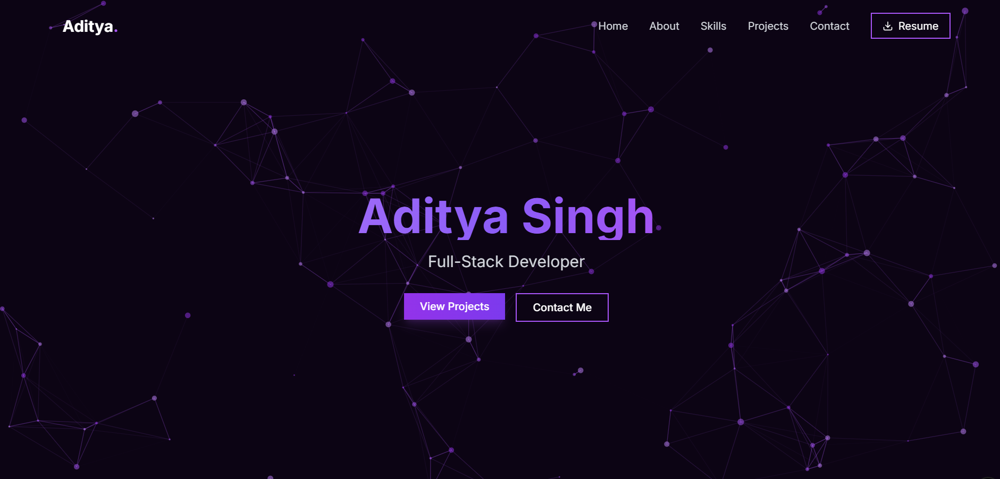
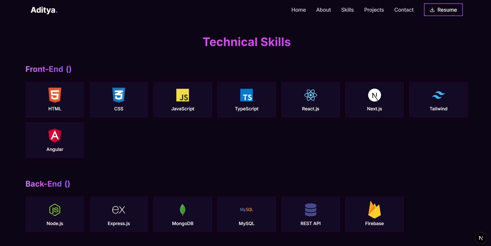
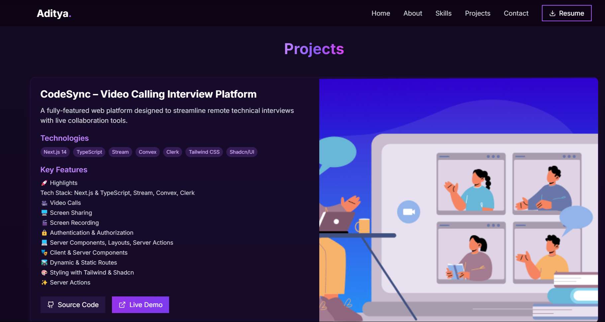
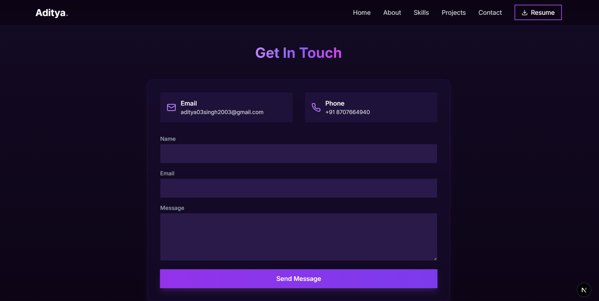

# 🚀 Aditya Singh's Developer Portfolio






Welcome to my interactive developer portfolio built with cutting-edge web technologies. This site showcases my skills through immersive 3D elements and smooth animations.

## 🌐 Live Demo
🔗 **Live Website:** [https://portfolio-silk-six-38.vercel.app/](https://portfolio-silk-six-38.vercel.app/)

## 🛠️ Tech Stack
### 🧩 Core Technologies
- 🚀 Next.js 15 (App Router)
- 🍃 Tailwind CSS + Framer Motion
- 🧊 Three.js (React Three Fiber)

### 📦 Key Libraries
- ⚛️ React Three Fiber
- 🔵 TypeScript
- 🎬 Framer Motion
- ✨ Radix Primitives

## 📸 Key Features
1. **🌌 Interactive 3D Elements**
   - 🌠 Dynamic particle background
   - 🎮 Animated 3D models

2. **💎 Modern UI/UX**
   - 🌙 Dark/light mode toggle
   - 🌀 Smooth page transitions

3. **⚡ Performance Optimized**
   - 🕰️ Lazy-loaded components
   - 📦 Optimized 3D assets

## 🚀 Quick Start
```bash
# Clone repository
git clone https://github.com/aditya03singh2003/Portfolio.git

# Install dependencies
pnpm install

# Start development server
pnpm dev