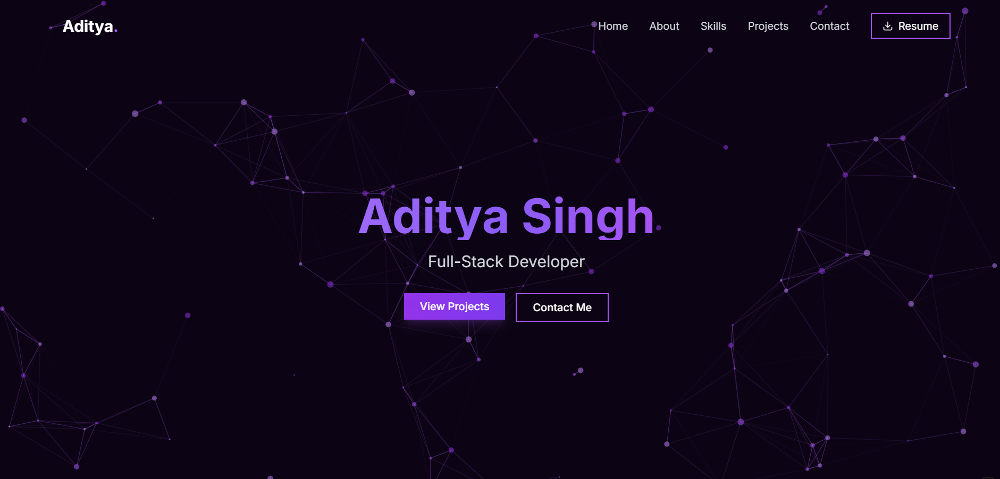
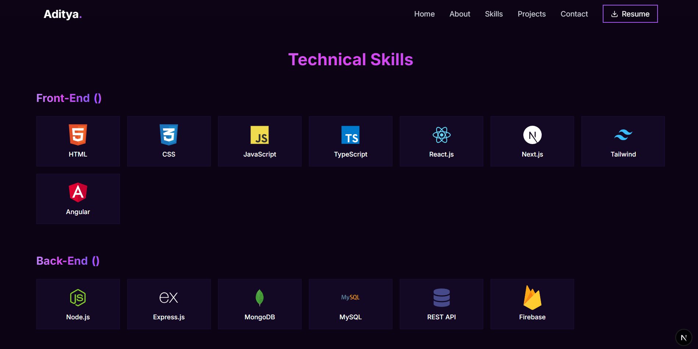
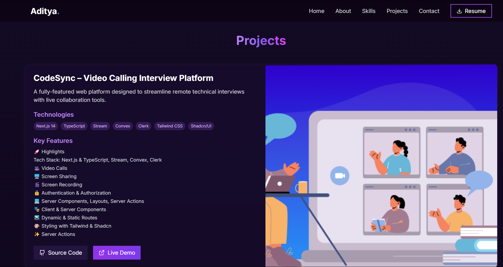
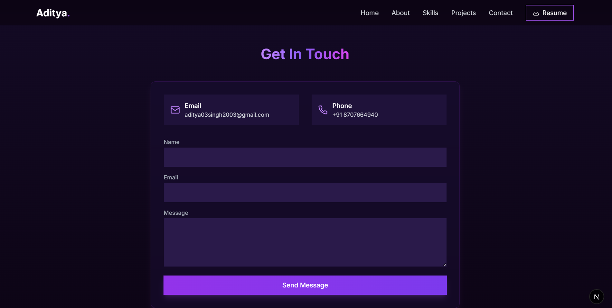

# 🚀 Aditya Singh's Developer Portfolio
A dynamic developer portfolio showcasing cutting-edge web development with Next.js 15, Three.js, and Tailwind CSS. Features immersive 3D animations, particle effects, and responsive UI components. Implements modern practices like server components, lazy loading, and dark mode. Demonstrates full-stack capabilities through project case studies and optimized performance. 

## 🌐 Live Demo
🔗 **Live Website:** [https://portfolio-silk-six-38.vercel.app/](https://portfolio-silk-six-38.vercel.app/)

## 🔥 Preview

### 🏠 Home Page


### 🛠 Technical Skills


### 💻 Projects


### 👋 Get In Touch


Welcome to my interactive developer portfolio built with cutting-edge web technologies. This site showcases my skills through immersive 3D elements and smooth animations.


## 🛠️ Tech Stack
### 🧩 Core Technologies
- 🚀 Next.js 15 (App Router)
- 🍃 Tailwind CSS + Framer Motion
- 🧊 Three.js (React Three Fiber)

### 📦 Key Libraries
- ⚛️ React Three Fiber
- 🔵 TypeScript
- 🎬 Framer Motion
- ✨ Radix Primitives

## 📸 Key Features
1. **🌌 Interactive 3D Elements**
   - 🌠 Dynamic particle background
   - 🎮 Animated 3D models

2. **💎 Modern UI/UX**
   - 🌙 Dark/light mode toggle
   - 🌀 Smooth page transitions

3. **⚡ Performance Optimized**
   - 🕰️ Lazy-loaded components
   - 📦 Optimized 3D assets

## 🚀 Quick Start
```bash
# Clone repository
git clone https://github.com/aditya03singh2003/Portfolio.git

# Install dependencies
pnpm install

# Start development server
pnpm dev
